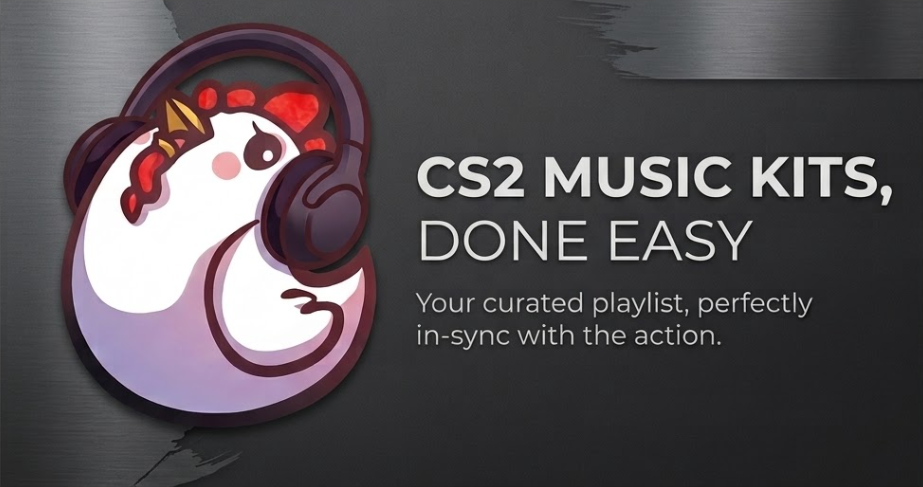

<div align="center">



# ChickBeat

**A lightweight Counter-Strike 2 GSI utility and custom music kit generator for free custom MVP anthems.**

[](https://github.com/TYFALY/ChickBeat/releases/latest)
[](https://dotnet.microsoft.com/download/dotnet/8.0)
[](https://github.com/TYFALY/ChickBeat/releases/latest)
[](https://www.virustotal.com/gui/file/b7f7af6e952595304dccd7da9678fd2ecbda48bfbcc55b21f7e66e8ab72c3c71)
[](https://github.com/TYFALY/ChickBeat/stargazers)

<br />

[**Download Latest .exe**](https://github.com/TYFALY/ChickBeat/releases/latest) · [VirusTotal Report](https://www.virustotal.com/gui/file/b7f7af6e952595304dccd7da9678fd2ecbda48bfbcc55b21f7e66e8ab72c3c71) · [Report Issue](https://github.com/TYFALY/ChickBeat/issues)

[Features](#core-features) · [Installation](#installation--usage) · [Trust & Anti-Cheat](#trust--anti-cheat-compliance) · [Tech Stack](#tech-stack)

</div>

---


## Core Features

| Feature | Description |
|---------|-------------|
| **Instant Link-to-Kit** | Direct conversion from YouTube/Spotify URLs via yt-dlp & FFmpeg with automated RMS energy mapping (drops/choruses to MVP & Round Start). |
| **Precision Stem Controls** | Per-channel volume sliders, 800ms fade-out engine on event stops, real-time NAudio preview. |
| **VAC Safe & Zero Memory Footprint** | 100% official Game State Integration (GSI) via HTTP payloads. No memory hooking, no game file editing, <40MB RAM usage. |
| **Standalone Binary** | Single self-contained Windows executable (.exe). No installer or complex setup required. |
---

## Installation & Usage

1. **Download** `ChickBeat.exe` from [GitHub Releases](https://github.com/TYFALY/ChickBeat/releases/latest).
2. **Run** the executable (handle SmartScreen warning if unsigned binary).
3. **Click "Equip"** on a kit, or create custom kits with the Kit Creator.

### How It Works In-Game

ChickBeat leverages Valve's official Game State Integration (GSI) to automatically trigger audio events without injecting into `cs2.exe`:

- **MVP Anthem:** Fires when GSI detects a killcam event
- **10-Second Bomb Warnings:** Triggers on timer countdown states from game HTTP payloads
- **Round Start Tracks:** Activates at round initialization signals via GSI state changes

Data flow: CS2 → GSI HTTP payloads → ChickBeat processor → NAudio output. Nothing touches the game executable or memory space.

---

## Trust & Anti-Cheat Compliance

### VAC and anti-cheat safety

> [!IMPORTANT]
> ChickBeat uses Valve's official Game State Integration (GSI) `.cfg` HTTP payloads. It does **not** touch `cs2.exe` memory, inject DLLs, or modify game files.

GSI is a [documented Valve feature](https://developer.valvesoftware.com/wiki/Counter-Strike:_Global_Offensive_Game_State_Integration): the game sends match state as HTTP payloads and ChickBeat reacts to them. Nothing runs inside the game process.

```text
CS2  ── GSI HTTP payloads ──▶  ChickBeat  ──▶  NAudio  ──▶  Your audio output
```

ChickBeat is closed source, so this is a statement of how it works, not something you can confirm by reading code. It is also not a guarantee from Valve, who do not review or endorse third-party tools.

### Windows SmartScreen and antivirus false positives

The first launch may show **"Windows protected your PC"**. This is expected for an unsigned binary:

- **No code-signing certificate.** SmartScreen judges executables by download reputation. Signing certificates cost hundreds of dollars a year, which most independent developers do not pay for. A new or rarely downloaded file gets flagged regardless of what it contains.
- **Self-contained single-file .NET binary.** The executable bundles the runtime and extracts parts of itself at launch, a pattern some antivirus heuristics treat with suspicion.
- **Helper tools.** Launching external tools (yt-dlp, FFmpeg) can trigger behavioral heuristics in some products.

**To run it anyway:**

1. Click **More info** in the SmartScreen dialog, then **Run anyway**.
2. If Windows still blocks it, right-click `ChickBeat.exe` → **Properties** → tick **Unblock** → **OK**. Or in PowerShell:

   ```powershell
   Unblock-File -Path .\ChickBeat.exe
   ```

### Verify your download

The [VirusTotal report](https://www.virustotal.com/gui/file/b7f7af6e952595304dccd7da9678fd2ecbda48bfbcc55b21f7e66e8ab72c3c71) is for the file with this SHA-256:

```text
b7f7af6e952595304dccd7da9678fd2ecbda48bfbcc55b21f7e66e8ab72c3c71
```

Check that your download matches:

```powershell
Get-FileHash .\ChickBeat.exe -Algorithm SHA256
```

---

## Tech Stack

- **C# / .NET 8**
- **[Avalonia UI 11](https://avaloniaui.net):** cross-platform UI framework
- **[NAudio](https://github.com/naudio/NAudio):** audio processing pipeline
- **yt-dlp:** YouTube/Spotify URL parsing and audio extraction
- **FFmpeg:** Audio transcoding and stem separation

---

## Feedback

Bug reports and feature requests: [GitHub Issues](https://github.com/TYFALY/ChickBeat/issues)

---

Counter-Strike, CS2, and Valve are registered trademarks of Valve Corporation. ChickBeat is an independent project and is not affiliated with or endorsed by Valve Corporation.
